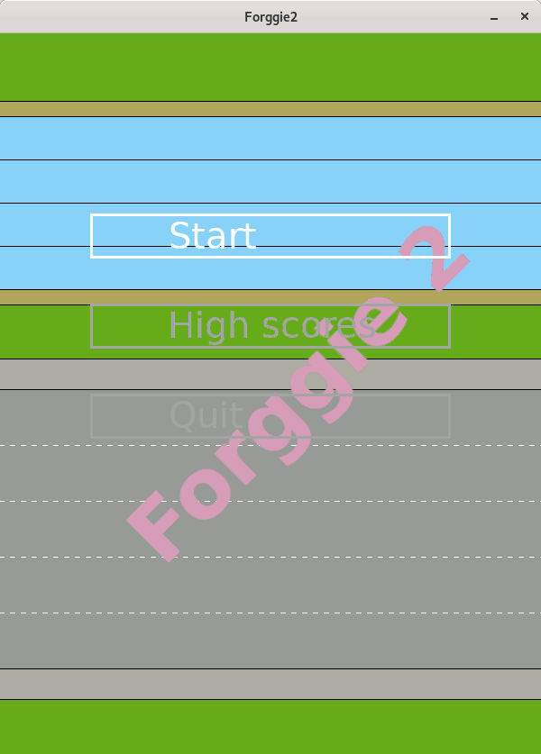

## 1. Description


This is an attempt to implement a frogger-like game.




## 2. How to install

This software uses Python 3.

On GNU/Linux:
```
$ git clone https://github.com/vnaitis/forggie2.git
$ virtualenv --python=python3 virtpy3
$ source virtpy3/bin/activate
$ cd forggie2
$ make
```


## 3. How to run it

On GNU/Linux:
```
$ cd forggie2/bin
$ ./forggie2.py
```


## 4. Controls

Arrow keys control the frog.

Escape key cancels the game and goes one level up in the menu. 


## 5. How to set up the dev environment

The same as "How to install".

```
$ cd forggie2
$ make test
```

Current implementation "limits" the width of the car image to 80 pixels.


## 6. Change log

2019-07-17 released version 1.0


## 7. License

Distributed under the GNU GPL v3 license. See [LICENSE](LICENSE) for more information.

